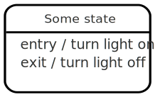

# Action

An action is the way a statechart can cause things to happen in the outside world, and indeed they are the main reason why the statecharts exist at all.  The main point of introducing a statechart is for the _actions_ to be invoked at the right times, depending on the sequence of [events](event.html){:.glossary} and the state of the [guards](guard.html){:.glossary}.

Actions are most commonly triggered on _entry_ or _exit_ of a [*state*](state.html){:.glossary}, although it is possible to place them on a [transition](transition.html){:.glossary} itself.

Actions should in general try to execute as quickly as possible, returning control to the statechart as quickly as possible, so that other actions may be executed.  This means that anything beyond setting a few variables, they should typically be used to _start_ and _stop_ asynchronous tasks.  Such asynchronous tasks that run _while in a state_ are called [*activities*](activity.html){:.glossary}.

## Examples

An example of an action might be to _enable_ a text field; such an action is of course synchronous, but it is also practically instantaneous.

Another example of an action would be to make an HTTP request.  This would of course be an asynchronous action, and might result in guards functions responding differently, and trigger events that the statechart might be interested in.

## Nested states

When a parent state and a substate are entered, then _entry_ handlers of the parent state are executed before _entry_ handlers of the substate.  Conversely, when a parent state and substate both exit, the child _exit_ handlers are executed before the parent state's _exit_ handlers.

## Notation

_entry_ and _exit_ actions in a state are prefixed with `entry /` or `exit /` as follows:

