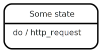

# Activity

An activity is the depiction of a long running process, that happens in the world outside of the statechart.  Contrast with [action](action.html){:.glossary} which is similar, but instantaneous.

Activities are mostly tied to the idea of _being_ in a [state](state.html){:.glossary}.  When the state machine enters a particular state, any _activities_ that are defined for that state should be started, and likewise, when the state machine exits such a state, they should be stopped.

Activities generally start immediately upon entering the state, and continue for as long as the activity can do so.  If the activity stops before the state is exited, the stopping of the activity is often treated as an [event](event.html){:.glossary} that the state machine can react to.  It is however not strictly required that the state exits when an activity stops.

Activities being active or not is also a case for a [guard condition](guard.html){:.glossary}.

## Examples

An example of an activity might be to show a particular user interface component.  The user interface component would be visible for a long time, and might generate events that cause state transitions.  When the state exits, the user interface component would no longer be shown.

Another example of an activity would be an active HTTP request.  This is a long running, and might result in guards functions responding differently, and trigger events that the statechart might be interested in.


## Notation

Activities in a state are prefixed with `do /` as follows:



## SCXML

SCXML has no depiction on activities.  Instead, use start and stop actions to control long running processes.

## xstate

Xstate has native support for activities.  By declaring that an activity should be happening in a particular state, xstate will translate this into actions to start and stop activities, and provide a set of booleans indicating which activities should be running.  To specify activities, use the `activities` property:

``` javascript
{
  activities: "http_request"
}

state = machine.transition(...);
state.activities // { "http_request": true }
```


## SCION-CORE

SCION core, which is heavily inspired by SCXML also has no depiction of activites.  Instead, use start and stop actions to control long running processes.
