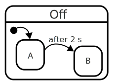

# Compound State

_Also known as **Composite state** and **Or state**_

A compound state is a [state](state.html){:.glossary} that includes one or more substates.  It is the main differentiating factor between traditional state machines and statecharts.  A compound state can be thought of as _containing its own state machine_.

## Notation

A compound state is a normal state with its substates depicted _inside_ the borders of the state itself:



Here, the state called **Off** is a compound state.  It has two states **A** and **B** as its substates.  Note how the substates constitute their own state machine, even with an [initial state](initial-state.html){:.glossary}.

## Description

If there are more than one substates, one of them is usually designated as the [initial](initial-state.html){:.glossary} state of that compound state.

When a compound state is active, its substates behave as though they were an active state machine:  Exactly one child state must also be active.  This means that:

* When a compound state is [entered](enter.html){:.glossary}, it must also enter exactly one of its substates, usually its initial state.
* When an [event](event.html){:.glossary} happens, the _substates_ have priority when it comes to selecting which transition to follow.  If a substate happens to handles an event, the event is consumed, it isn't passed to the parent compound state.
* When a substate [transitions](transition.html){:.glossary} to another substate, both "inside" the compound state, the compound state does _not_ exit or enter; it remains active.
* When a compound state [exits](exit.html){:.glossary}, its substate is simultaneously exited too. (Ttechnically, the substate exits first, _then_ its parent.)

Compound states may be nested, or include [parallel](parallel-state.html){:.glossary} states.

The opposite of a compound state is an [atomic state](atomic-state.html){:.glossary}, which is a state with no substates.

A compound state is allowed to define transitions to its child states. Normally, when a transition leads from a state, it causes that state to be exited.  For transitions from a compound state to one of its descendantes, it is possible to define a transition that avoids exiting and entering the compound state itself, such transitions are called [local transitions](local-transition.html){:.glossary}. 

## Usage

An atomic state is often converted to a compound state in order to change its behaviour slightly.  The newly introduced substates get a chance to override the behaviour by defining how to react to different events.  The substates only need to define the differences in behaviour.  The (now) compound state defines the general behaviour, and substates define deviations from this behaviour.

The act of changing an atomic state into a compound state (by introducing a substate or two) is called _refining_ the state.  The refinement alludes to the different behaviour encoded in the substates as being a _refinement_, or _specialization_ of the general behavour of the compound state.

A group of states can be collected into a compound state to factor out _common transitions_.  For example, if five sibling states all have the same transitions to a particular target, it can be beneficial to move those five states into a single compound state, and then move the individual transitions to the compound state.

The act of grouping states with commonalities into a compound state is called _clustering_.

Technically a statechart itself is usually (at the top level) a compound state itself.  Some systems allow the machine to be a parallel state.


### Zooming in and out

The nesting of states in a hierarchy can lead to complicated charts when it is visualized.  It is possible to conceal the internals of a compound state by excluding substates from the visualization.  This technique is called _zooming out_.  Zooming _in_ would then reveal the details.

## SCXML

In Statechart XML, a compound state is any state with nested state elements as direct children; this includes `<parallel>`, `<initial>` elements too, as these are also state elements.

``` xml
<state id="off">
  <transition event="flick" target="on" />
  <state id="A"/>
  <state id="B"/>
</state>
```

A compound state's initial state is either identified by the `initial` attribute of the compound state, or the `<initial>` state, and if none of these is specified, the first state in document order.

## XState

An XState [compound state](https://xstate.js.org/docs/guides/hierarchical.html) is declared using the `states` property of the state, holding an object containing substates.  Each key value pair declares the name and definition of the state, respectively.

```javascript
"off": {
  "on": {
    "flick": "on"
  }
  "initial": "A",
  "states": {
    "A": {  },
    "B": {  }
  }
}
```

The `initial` property must specify the initial state.

## SCION-CORE

In SCION-CORE, a compound state is declared by specifying the `states` property of the state in question, containing an array of state objects.

``` javascript
{
  id: "off",
  states: [
    {
      id: "A",
    },
    {
      id: "B",
    }
  ]
}
```

Unless explicitly specified using the `initial` property, the first item in the state becomes the initial state.
