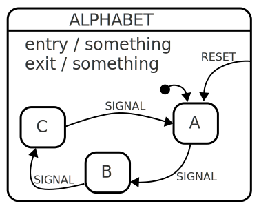

# Internal transition

A transition from a [compound state](compound-state.html){:.glossary} to its direct children normally causes the _compound_ state to exit, then enter again.  In an internal transition, the compound state does not enter and exit again.

Consider the following state:



The state starts out in state A, but the "SIGNAL" signal moves it between its substates, A, B and C.  The transitions between A, B, C don't cause the top level state S to exit, so the SIGNAL state does not, for example cause the entry or exit actions to happen.

But the "RESET" signal however, goes _from_ state S _to_ state A.  If this is a normal transition, it would cause state S to _exit_ and then _enter_ again, before finally enter A.  However, sometimes the exit and entry of state S is unwanted.  IF RESET is declared to be an internal transition, it does not exit the source state.

Internal transitions are only possible to define _from_ a composite state and _to_ its children.

## Notation

TBD:

## xstate

Xstate does not yet support internal transitions

## SCXML

SCXML's `<transition>` has a `type` attribute which can be set to `internal` to declare a transition as internal:

```
<state id="ALPHABET" initial="A">
  <onentry>something</onentry>
  <onexit>something</onexit>
  <transition event="RESET" target="A" type="internal" />
  <state id="A">
    <transition event="SIGNAL" target="B"/>
  <state>
  <state id="B">
    <transition event="SIGNAL" target="C"/>
  <state>
  <state id="C">
    <transition event="SIGNAL" target="A"/>
  <state>
</state>
```
