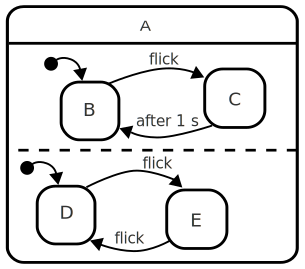

# Parallel state

A parallel state is a [state](state.html){:.glossary} that is divided into separate regions.  Each region contains more substates.  When a parallel state is entered, _each_ of the regions are also entered; their [initial states](initial-state.html){:.glossary} are entered and so on.

If the state above is entered, both B and D states are entered too.  As you can see the _flick_ event is handled by both B _and_ D.  If the _flick_ event happens, _both_ B and D get to "handle" the event, and the resulting state is C _and_ E.

If another _flick_ event happens E will transition back to D, while C will ignore the event, since C doesn't handle the event.  After 1 second, C will transition back to B, ready to handle the _flick_ event again.

## Notation

A parallel state is like any other state, but it is subdivided into regions by way of straight, dashed lines.  Each such region can then include states.

## SCXML

In Statechart XML, [the `<parallel>` element](https://www.w3.org/TR/scxml/#parallel) declares a parallel state.  It has more or less exactly the same set of attributes and elements as the `<state>` element, except it has no _initial_ or _final_ states.  The various _regions_ are defined by way of the direct child `<state>` elements.

This is a parallel state with two _regions_. When `p` becomes active, so does `foo-1` and `bar-1`

    <parallel id="p">
      <state id="region-1">
        <state id="foo-1"/>
        <state id="foo-2"/>
      </state>
      <state id="region-2">
        <state id="bar-1"/>
        <state id="bar-2"/>
      </state>
    </parallel>

Parallel states may contain other parallel states as direct children, but technically this is equivalent as though the direct children's direct children were "pulled up" to the top level.
