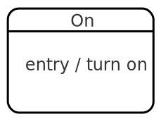

# State

A state in a state machine is a definition of a particular configuration of [events](event.html){:.glossary} to handle and [transitions](transition.html){:.glossary} to execute, when the state machine is _in_ that state, along with a specification of which [actions](action.html){:.glossary} to perform when the state is entered or exited.

A state in a statechart additionally holds any number of "subordinate" states, or substates, which constitute a subordinate new state machine which should be executed whenever the statechart is _in_ that state.  A [parallel state](parallel-state.html){:.glossary} is a state that is the parent of several _state machines_.

When a state machine is _executed_, it _enters_ the [initial state](initial-state.html){:.glossary}, and the machine reacts to the events dictated by that state by "moving" to the transition's target state.

## Notation

A state is generally depicted as a rounded box, with the name of the state centered at the top of the box, with a horizontal line sparating the name of the state from the actions and substates.  The original statechart paper did not have these lines, they come from the UML Statechart standard.  It is common to drop this line in states that have no substates and no actions.

Transitions _from_ this state are depicted as curvy lines pointing away.  Transitions _to_ this state are depicted as curved lines that point to this state.

Entry and Exit actions are typically written above the substates, which are spread freely around the interior of the state.

## SCXML

In SCXML, a state is defined by the `<state>` element, with the name of the state in its `id` attribute.  Inside the state are entry and exit actions, transitions, along with substates:

    <state id="my_state">
      <onentry>
        
      </onentry>
      <transition event="some_event" target="some_other_state"/>
      <state id="my_substate">
        transition event="some_event" target="my_other_substate"/>
      </state>
      <state id="my_other_substate"/>
    </state>

