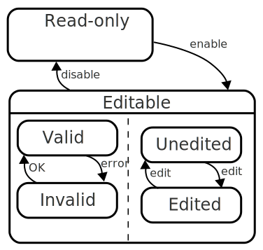

---
sitemap:
  lastmod: 2018-12-25
  priority: 0.3
  changefreq: yearly
category: benefits
---

# Easy to understand

Once a developer gets past the initial hurdle of understanding statecharts, understanding a component whose behaviour is encoded in a statechart is a lot easier than understanding a component that is not based on statecharts.

## Traditional code

When trying to understand traditional components, you have no choice but to dive into the code.  The code is a mix of behaviour and side effects, structured in various ways, be it functional, procedural or object oriented, callback-based or promise-based.  Often the code looks something like this:

``` javascript
if (isValid && isEditable && isModified) {
  class = "dirty";
} else if (!isValid && isEditable && isModified) {
  class = "invalid";
} else if // and so on
```

Such code is present when _determining what to do_ e.g. when a user clicked a button, or a HTTP response arrived, or some database reported an error.

## Statecharts based code

When trying to understand a statechart based component, you have the choice of looking at a statechart, maybe even an image of it, to understand the behaviour in isolation.  A statechart diagram might look something like this:



With a little knowledge of statecharts, it's clear that the two "booleans" unedited/edited and valid/invalid are independent, but both depend on being _editable_ to have any meaning.

The remaining code (the [actions](glossary/action.html){:.glossary}, [guards](glossary/guard.html){:.glossary} and [activities](glossary/activity.html){:.glossary}) is easy to grasp too.  Each is extracted to its own method:

```javascript
function edited() {
  this.class = "edited";
}
```

The conditional logic has been tucked away in the state machine / statechart.

Put simply: There is a usable _method_ to understand code that uses the statechart approach.

## Diagrams

The original statechart paper by Harel described only a _diagram_ and ways of depicting statecharts as pure drawings.  It is a good idea to take whatever statechart representation there is, e.g. a JSON file or JavaScript object, and produce _actual drawings_ of the coded statecharts as part of building the code.  Luckily, there are tools and libraries that can do this.  Think of it as a form of the _Don't Repeat Yourself_ rule: Keep a single authoritative representation of a piece of knowledge in the system (the statechart as a JSON file perhaps) and derive others from it (e.g. an SVG).  When diagrams are included in this set of generated representations, it makes statecharts a _lot_ easier to understand.

## Sources

> \[It is] easier to show a statechart to a systems engineer, than a bunch of C code \[...]  \[helped people that] haven't been with the \[...] project throughout the cycle
>
> <cite><a href="https://www.youtube.com/watch?v=VvssxOP95s0">UML State Chart Autocoding</a>, Eddie Benowitz, JPL</cite> 

> Code reviews for the modules constructed using a bottom-up approach were difficult and time consuming. Design and code reviews of the statechart modules were quick and effective because the software could be understood by reviewers.
>
> <cite>Constructing the User Interface with Statecharts, Ian Horrocks, page 200</cite>
