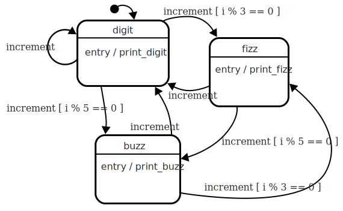
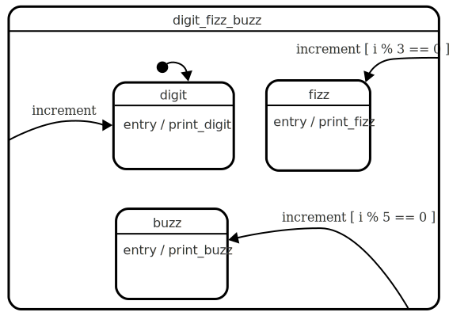

# FizzBuzz with Actions and guards

FizzBuzz is a programming puzzle, easily solvable using a simple for-loop.  The puzzle has been described in terms of an event driven system, in order to allow us to explore some statechart concepts.  See [FizzBuzz](fizzbuzz.html) for an explanatory introduction.

Here, we will show how [actions](glossary/action.html){:.glossary} can be used to let the statechart tell us what to do.  We will use [guards](glossary/guard.html){:.glossary} to tell the statechart which state it should be in.  Note that this is not an endorsement to use statecharts to solve FizzBuzz!

## Start with digits

Let’s start with a machine that prints out only the digits.

**This simple statechart re-enters the _digit_ state every _increment_ event.**{:.caption}


Here is the xstate representation, in JSON format:

**This statechart represents the diagram above, in xstate syntax**{:.caption}
``` javascript
const statechart = {
  initial: 'digit',
  states: {
    digit: {
      on: {
        increment: 'digit'
      },
      onEntry : 'print_digit'
    }
  }
}
```

The following code goes through a for loop, increments 'i', and sends the machine an event called _increment_.

**This loop "generates" an event every iteration.**{:.caption}
``` javascript
const machine = Machine(statechart);

state = machine.initialState;
for (i = 1; i < 100; i++) {
  state = machine.transition(state, 'increment', i);
}
```

For now it doesn't do much, it remains in the _digit_ state constantly re-[entering](glossary/entry.html){:.glossary} it.  When it re-enters the state, it invokes the digit state's entry [action](glossary/action.html){:.glossary}.  We need to look for those actions and execute whatever the statechart tells us to do.

We'll set up a little dictionary of actions, corresponding to the actions mentioned in the statechart.  For now all we have is `print_digit`.

**Side effects are executed after every state `transition()`.**{:.caption}
``` javascript
const actions = {
  print_digit: (i) => console.log(i)
}

for (i = 1; i < 100; i++) {
  state = machine.transition(state, 'increment', i)
  state.actions.forEach(item => actions[item](i));
}
```

This code should print out the digits 1 through 100.  In the embedded codepens I've replaced the console.log with `document.write('<li>' + i + '</li>')`

<p data-height="455" data-theme-id="light" data-slug-hash="aKmZow" data-default-tab="js" data-user="mogsie" data-embed-version="2" data-pen-title="FizzBuzz with actions and guards 1: Digits only" class="codepen">See the Pen <a href="https://codepen.io/mogsie/pen/aKmZow/">FizzBuzz with actions and guards 1: Digits only</a> by Erik Mogensen (<a href="https://codepen.io/mogsie">@mogsie</a>) on <a href="https://codepen.io">CodePen</a>.</p>
<script async src="https://static.codepen.io/assets/embed/ei.js"></script>

### Checkpoint

We have a simple machine that has a single state.  We've shown how a [self transition](glossary/self-transition.html){:.glossary} can be used to re-enter a state, solely to trigger entry [actions](glossary/action.html){:.glossary} every time an event is fired.

## Adding Fizz

Now let’s change the behaviour so that it prints out Fizz when the counter is divisible by 3.  Printing out Fizz is a different _action_ than printing out the digit, so our goal is to ensure that the new `print_fizz` action only happens when it should, and that the `print_digit` action is _not_ fired.

We will introduce a new state, `fizz` with the `print_fizz` action.  When the `increment` event happens, we will alternate between the two states, and use the onEntry actions on each state to cause the desired side effect.

The statechart diagram we're aiming form looks something like this:

**Updated diagram with new _fizz_ state.**{:.caption}


Let's introduce the new _fizz_ state, with its entry action _print_fizz_:

**The new _fizz_ state, with the `print_fizz` action.**{:.caption}
``` javascript
states: {
  digit: {
    ...
  },
  fizz: {
    onEntry : 'print_fizz'
  }
}
```

The new action `print_fizz` should be added to the action dictionary:

**The `print_fizz` action now in the `actions` dictionary.**{:.caption}
``` javascript
const actions = {
  print_digit: (i) => console.log(i),
  print_fizz: () => console.log('Fizz')
}
```

We want to transition from _digit_ to _fizz_ whenever the number is incremented, and divisible by 3.  So we have to change the event definitions in the _digit_ state:

**The transitions of the from the `digit` state.**{:.caption}
``` javascript
on: {
  increment: [
    { cond: (i) => i%3==0, target: 'fizz' },
    { target: 'digit' }
  ]
}
```

This (the `on.increment[]` array) is essentially a series of if-tests, which are evaluated when we're in this state:  It can be read as follows:

 * First, if `i%3 == 0` then we go to the _fizz_ state
 * Otherwise, we go to the _digit_ state.

In the _fizz_ state, we know that we'll never be in the _fizz_ state immediately after a _fizz_ state, so the _fizz_ state can simply transition to _digit_ with no checks:

**The transitions of the from the `fizz` state.**{:.caption}
``` javascript
on: {
  increment: 'digit'
}
```

Here's the final code for the "fizz only" solution:

<p data-height="455" data-theme-id="light" data-slug-hash="XYjKmR" data-default-tab="js" data-user="mogsie" data-embed-version="2" data-pen-title="FizzBuzz with actions and guards 2: Fizz" class="codepen">See the Pen <a href="https://codepen.io/mogsie/pen/aKmZow/">FizzBuzz with actions and guards 1: Fizz</a> by Erik Mogensen (<a href="https://codepen.io/mogsie">@mogsie</a>) on <a href="https://codepen.io">CodePen</a>.</p>

This machine has two states, and every time it gets the ‘increment’ event, depending on which state it's in, it might evaluate the condition, and transitions to _fizz_ or _digit_ appropriately.  

### Checkpoint

We've shown how to use a [guard](glossary/guard.html){:.glossary} condition to make a transition only happen under certain circumstances.  Perhaps more subtly, we've shown that the behaviour can be changed by making changes to the statechart definition itself.

## Adding support for Buzz

The steps involved in adding support for printing "Buzz" is somewhat similar to addding "Fizz", but there are some important differences, which will be explained.

First of all, we need a new action, `print_buzz`, which lives in the action dictionary:

**The `print_fizz` action added to the actions dictionary.**{:.caption}
``` javascript
const actions = {
  print_digit: (i) => console.log(i),
  print_fizz: () => console.log('Fizz'),
  print_buzz: () => console.log('Buzz')
}
```

We'll also need the _buzz_ state, with its entry action _print_buzz_:

**The new `buzz` state, invoking the right action.**{:.caption}
``` javascript
states: {
  digit: {
    ...
  },
  fizz: {
    ...
  }
  buzz: {
    onEntry : 'print_buzz'
  }
}
```

So far, so good!  On to defining the transitions.  We will use another guarded transition, this time, with the guard `i % 5 == 0`.

* The _digit_ state already checks for 'fizz', now the state also needs a transition to _buzz_ if divisible by 5.
* The same check needs to happen in Fizz too.
* When in buzz we need to check if it's divisible by 3, and transition to _fizz_, like the _digit_ state does.

We can already see that there is some redundancy, it becomes clearer in the statechart diagram:

**The statechart with digit, fizz, and buzz states.  The number of transitions increases noticably.**{:.caption}


There are a number of transitions that are identical, and this is by definition a maintenance burden.  Imagine adding support for FizzBuzz; it would require another state, but six or more transitions, many of them duplicates.

We can use the hierarchical nature of statecharts to solve this particular problem, making it both easier to describe, and easier to maintain:

* Introduce a [compound state](glossary/compound-state.html){:.glossary} _around_ the three states.
* Move common transitions from the substates to the parent state.

The diagram ends up looking like this:

**The introduction of a compound state results in a much simpler diagram.**{:.caption}


This is clearly a simpler model, where the logic to choose which transition to pick has been moved to the superstate.  In our xstate code, the statechart is defined as follows:

**The xstate definition for the statechart diagram above.**{:.caption}
``` javascript
{
  initial: 'digit_fizz_buzz',
  states: {
    digit_fizz_buzz: {
      initial: 'digit',
      on: {
        increment: [
          { cond: (i) => i%3==0, target: '.fizz' },
          { cond: (i) => i%5==0, target: '.buzz' },
          { target: '.digit' }
        ]
      },
      states: {
        digit: {
          onEntry : 'print_digit'
        },
        fizz: {
          onEntry : 'print_fizz'
        },
        buzz: {
          onEntry : 'print_buzz'
        }
      }
    }
  }
}
```

The machine now has a single root state, `digit_fizz_buzz` which has

* three substates
* three transitions on the 'increment' event, one to each of the substates.

<p data-height="455" data-theme-id="light" data-slug-hash="jKMrPP" data-default-tab="js" data-user="mogsie" data-embed-version="2" data-pen-title="FizzBuzz with actions and guards 2: Fizz Buzz" class="codepen">See the Pen <a href="https://codepen.io/mogsie/pen/aKmZow/">FizzBuzz with actions and guards 2: Fizz Buzz</a> by Erik Mogensen (<a href="https://codepen.io/mogsie">@mogsie</a>) on <a href="https://codepen.io">CodePen</a>.</p>

### Checkpoint

We've identified complexity before it crept into the code, by extracting common behaviour to a superstate, by moving the transitions from the substates to the superstates.

## Handling FizzBuzz

TKTK


That was easy.  We could continue doing this for the FizzBuzz case:

TK embed [codepen](https://codepen.io/mogsie/pen/QxKEKj)

The guard condition in this "solution" looks a lot like the if/else statements as in the first non-statechart example shown in the [introduction](fizzbuzz.html):


```
// After (example 1)
For i = 1; i < 100; i++ {
  If i%3 && i%5 == 0, print fizzbuzz
  Else If i%3 == 0, print fizz
  Else If i%5 == 0, print buzz
  Else print digit
}
```

Guard condition:

```
increment: [
  { cond: (i) => i%3==0 && i%5==0, target: '.fizzbuzz' },
  { cond: (i) => i%3==0, target: '.fizz' },
  { cond: (i) => i%5==0, target: '.buzz' },
  { target: '.digit' }
]
```

The order of these if/else statements is just as important as the order of the guarded transitions.  Both of these are relatively unmaintainable, mainly because of the long chain of if/else statements.

## Refining the _FizzBuzz_ state

There is one slight optimization we can do.  This will show how substates are "more important" when it comes to reacting to events.  Based on the fact that we’re incrementing, we know a thing or two about `i - 1` — i.e. the previous integer.  IF the previous integer was a FizzBuzz, it is impossible that this integer is a Fizz _or_ a buzz.  It must _always_ be a a digit.  Knowing this we can tell the statechart to ignore the guarded transition, and simply _always_ go to 'digit' when we get an _increment_ event in the 'fizzbuzz' state.

```
    fizzbuzz: {
      onEntry : 'print_fizzbuzz',
      on: {
        increment: 'digit'
      }
    }
```

TK embed this [codepen](https://codepen.io/mogsie/pen/QxKEKj)...

This optimization is a nice one that most imperative solutions miss, because every for-loop usually forgets any calculations in the previous iteration.  With statecharts, insights like this come more naturally.  However, with the this design, it is hard to add more optimizations.


## Conclusion

We have shown the use of guards and how a single event can cause many possible transitions to be checked.  That the first guard that passes will be taken.  We have shown how actions can be placed on states, and how entering those states triggers those actions.  Finally, we have shown how we can specialize a state, overriding its behaviour simply by adding a transition in a substate.

Take a look at [the introduction](fizzbuzz.html) to explore different aspects of statecharts.
