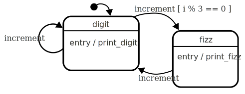

# FizzBuzz with Actions and guards

FizzBuzz is a programming puzzle, easily solvable using a simple for-loop.  The puzzle has been described in terms of an event driven system, in order to allow us to explore some statechart concepts.  See [FizzBuzz](fizzbuzz.html) for an explanatory introduction.

Here, we will show how [actions](glossary/action.html){:.glossary} can be used to let the statechart tell us what to do.  We will use [guards](glossary/guard.html){:.glossary} to tell the statechart which state it should be in.

## Start with digits

Let’s start with a machine that prints out only the digits.


Here is the xstate representation, in JSON format:

``` javascript
const statechart = {
  initial: 'digit',
  states: {
    digit: {
      on: {
        increment: 'digit'
      },
      onEntry : 'print_digit'
    }
  }
}
```

The following code goes through a for loop, increments 'i', and sends the machine an event called _increment_.

``` javascript
const machine = Machine(statechart);

state = machine.initialState;
for (i = 1; i < 100; i++) {
  state = machine.transition(state, 'increment', i)
}
```

For now it doesn't do much, it remains in the _digit_ state constantly re-[entering](glossary/entry.html){:.glossary} it.  When it re-enters the state, it invokes the digit state's entry [action](glossary/action.html){:.glossary}.  We need to look for those actions and execute whatever the statechart tells us to do.

We'll set up a little dictionary of actions, corresponding to the actions mentioned in the statechart.  For now all we have is `print_digit`.

``` javascript
const actions = {
  print_digit: (i) => console.log(i);
}

for (i = 1; i < 100; i++) {
  state = machine.transition(state, 'increment', i)
  state.actions.forEach(item => actions[item](i));
}
```

This code should print out the digits 1 through 100.  In the embedded codepens I've replaced the console.log with `document.write('<li>' + i + '</li>')`

<p data-height="455" data-theme-id="light" data-slug-hash="aKmZow" data-default-tab="js" data-user="mogsie" data-embed-version="2" data-pen-title="FizzBuzz with actions and guards 1: Digits only" class="codepen">See the Pen <a href="https://codepen.io/mogsie/pen/aKmZow/">FizzBuzz with actions and guards 1: Digits only</a> by Erik Mogensen (<a href="https://codepen.io/mogsie">@mogsie</a>) on <a href="https://codepen.io">CodePen</a>.</p>
<script async src="https://static.codepen.io/assets/embed/ei.js"></script>

### Checkpoint

We have a simple machine that has a single state.  It re-enters the `digit` state, causing the onEntry action to happen every time.

## Adding Fizz

Now let’s change the behaviour so that it prints out Fizz when the counter is divisible by 3.  We can introduce a new state, `fizz` and use the event to alternate between the two states, and use the onEntry actions on each state to cause the desired side effect.

To start off we'll introduce a new state, _fizz_ with a new action _print_fizz_:

``` javascript
   fizz: {
     onEntry : 'print_fizz'
   }
```

We want to transition from _digit_ to _fizz_ whenever the number is incremented, and divisible by 3.  So we have to change the event definitions in the _digit_ state:

``` javascript
on: {
  increment: [
    { cond: (i) => i%3==0, target: 'fizz' },
    { target: 'digit' }
  ]
}
```

This essentially is a series of if-tests, which are evaluated when we're in this state:  First, if `i%3 == 0` then we go to the _fizz_ state, otherwise, we go to the _digit_ state.

In the _fizz_ state, we know that we'll never be in the _fizz_ state immediately after a _fizz_ state, so the _fizz_ state can simply transition to _digit_:

``` javascript
on: {
  increment: 'digit'
}
```

The statechart diagram now looks like this:



<p data-height="455" data-theme-id="light" data-slug-hash="XYjKmR" data-default-tab="js" data-user="mogsie" data-embed-version="2" data-pen-title="FizzBuzz with actions and guards 2: Fizz" class="codepen">See the Pen <a href="https://codepen.io/mogsie/pen/aKmZow/">FizzBuzz with actions and guards 1: Fizz</a> by Erik Mogensen (<a href="https://codepen.io/mogsie">@mogsie</a>) on <a href="https://codepen.io">CodePen</a>.</p>

This machine has two states, and every time it gets the ‘increment’ event it evaluates the condition and transitions to fizz or Digit appropriately.  But we’re repeating the guard condition, which is generally a bad idea.  We can place the event handler on the top level, since they are common for all substates.

TK embed this: [codepen](https://codepen.io/mogsie/embed/MXjeKj)

The machine will exit whatever state it’s in and enter the correct state based on the guard condition of `ìncrement`.

We can now extend this machine to handling the ‘buzz’ case quite easily

TK embed: [On codepen](https://codepen.io/mogsie/embed/jKMrPP)

That was easy.  We could continue doing this for the FizzBuzz case:

TK embed [codepen](https://codepen.io/mogsie/pen/QxKEKj)

The guard condition in this "solution" looks a lot like the if/else statements as in the first non-statechart example shown in the [introduction](fizzbuzz.html):


```
// After (example 1)
For i = 1; i < 100; i++ {
  If i%3 && i%5 == 0, print fizzbuzz
  Else If i%3 == 0, print fizz
  Else If i%5 == 0, print buzz
  Else print digit
}
```

Guard condition:

```
increment: [
  { cond: (i) => i%3==0 && i%5==0, target: '.fizzbuzz' },
  { cond: (i) => i%3==0, target: '.fizz' },
  { cond: (i) => i%5==0, target: '.buzz' },
  { target: '.digit' }
]
```

The order of these if/else statements is just as important as the order of the guarded transitions.  Both of these are relatively unmaintainable, mainly because of the long chain of if/else statements.

## Refining the _FizzBuzz_ state

There is one slight optimization we can do.  This will show how substates are "more important" when it comes to reacting to events.  Based on the fact that we’re incrementing, we know a thing or two about `i - 1` — i.e. the previous integer.  IF the previous integer was a FizzBuzz, it is impossible that this integer is a Fizz _or_ a buzz.  It must _always_ be a a digit.  Knowing this we can tell the statechart to ignore the guarded transition, and simply _always_ go to 'digit' when we get an _increment_ event in the 'fizzbuzz' state.

```
    fizzbuzz: {
      onEntry : 'print_fizzbuzz',
      on: {
        increment: 'digit'
      }
    }
```

TK embed this [codepen](https://codepen.io/mogsie/pen/QxKEKj)...

This optimization is a nice one that most imperative solutions miss, because every for-loop usually forgets any calculations in the previous iteration.  With statecharts, insights like this come more naturally.  However, with the this design, it is hard to add more optimizations.


## Conclusion

We have shown the use of guards and how a single event can cause many possible transitions to be checked.  That the first guard that passes will be taken.  We have shown how actions can be placed on states, and how entering those states triggers those actions.  Finally, we have shown how we can specialize a state, overriding its behaviour simply by adding a transition in a substate.

Take a look at [the introduction](fizzbuzz.html) to explore different aspects of statecharts.
