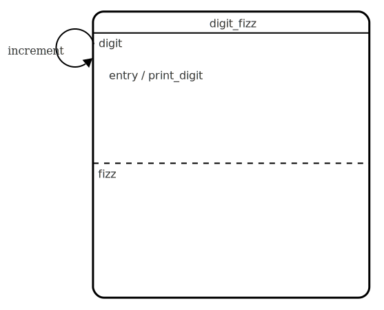
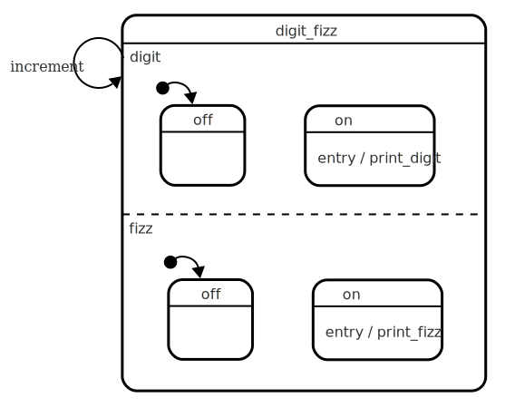
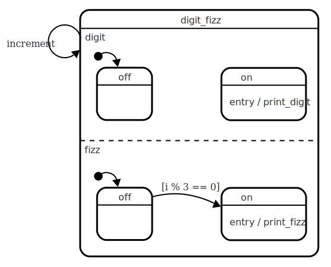
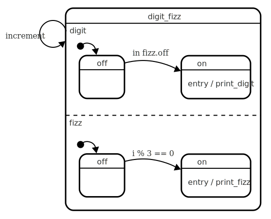
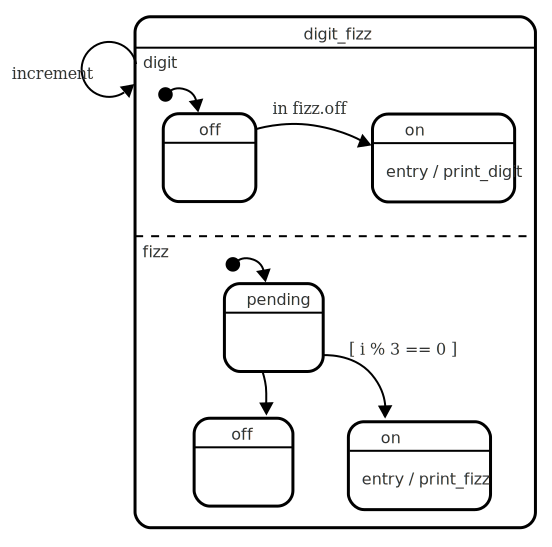
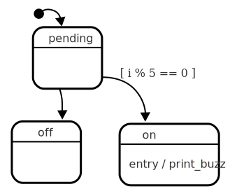
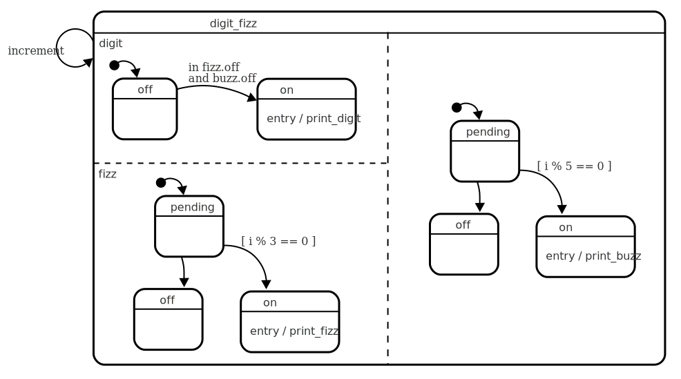
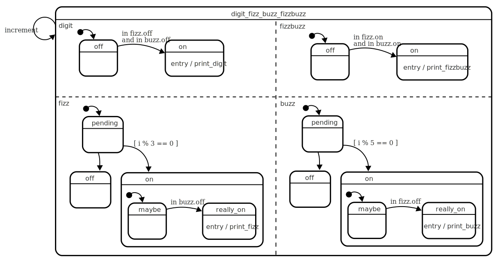

# FizzBuzz with actions and internal events

FizzBuzz is a programming puzzle, easily solvable using a simple for-loop.  For the purpose of this article, the puzzle has been described in terms of an event driven system, so that we can explore some statechart concepts.  See [FizzBuzz](fizzbuzz.html) for an explanatory introduction.

Here, we will split the problem into discrete problems: Digit, Fizz, Buzz and so on.  We will use a [parallel state](glossary/parallel-state.html){:.glossary} to tie them together.  In order to coordinate between the regions, we will use some transitions that are [automatic](glossary/automatic-transition.html){:.glossary} (meaning that they happen as soon as possible), and [guarded](glossary/guard.html){:.glossary} (meaning that they aren't taken unless some condition holds true).  Also note that this is not an endorsement to use statecharts to solve FizzBuzz!

{:.note}
If you've read [FizzBuzz with Actions and guards](fizzbuzz-actions-guards.html) then this first section is more or less identical as the section with the same name, up until the first checkpoint.

## Start with digits

Let's start with a machine that only prints out the digits.

**This simple statechart re-enters the _digit_ state every _increment_ event**{:.caption}

This machine has a self transition, that re-enters the _digit_ state every time we generate the _increment_ event, which in turn causes the entry action to be performed.

Here's the xstate equivalent:

**This statechart represents the diagram above, in xstate syntax**{:.caption}
``` javascript
const statechart = {
  initial: 'digit',
  states: {
    digit: {
      on: {
        increment: 'digit'
      },
      onEntry : 'print_digit'
    }
  }
}
```

The statechart definition needs to be passed to the `xstate.Machine` function.  This machine provides us with the _initial_ state, and a way to jog the state machine (`transition()`).  The following code goes through a for loop, which increments ‘i’, and sends the machine an event called `increment`.

**This loop “generates” an event every iteration.**{:.caption}
``` javascript
const machine = Machine(statechart);

state = machine.initialState;
for (i = 1; i < 100; i++) {
  state = machine.transition(state, 'increment', i);
}
```

We’ll set up a little dictionary of actions, corresponding to the actions mentioned in the statechart.  At the moment, all we need is `print_digit`.

**Any side effects should be executed after every transition().**{:.caption}
``` javascript
const actions = {
  print_digit: i => console.log(i)
}

for (i = 1; i < 100; i++) {
  state = machine.transition(state, 'increment', i)
  state.actions.forEach(item => actions[item](i));
}
```

This code should print out the digits 1 through 100.  In the embedded codepens I’ve replaced the `console.log` with `document.write` statements:

<p data-height="455" data-theme-id="light" data-slug-hash="pZwKQG" data-default-tab="js" data-user="mogsie" data-embed-version="2" data-pen-title="FizzBuzz with actions and internal events 1: Digits only" class="codepen">See the Pen <a href="https://codepen.io/mogsie/pen/pZwKQG/">FizzBuzz with actions and internal events 1: Digits only</a> by Erik Mogensen (<a href="https://codepen.io/mogsie">@mogsie</a>) on <a href="https://codepen.io">CodePen</a>.</p>
<script async src="https://static.codepen.io/assets/embed/ei.js"></script>

### Checkpoint

We have a simple machine that has a single state.  We’ve shown how a self transition can be used to re-enter a state, solely to trigger entry actions every time an event is fired.

## Extracting a parallel state machine

The purpose of this article is to show how to use a parallel state, so the first thing we need to do is to convert the state into a parallel state.  We will subdivide the state we have, dividing it up into two orthogonal regions.  One region will take care of "digit" and one will take care of "fizz".  Essentially we're converting the 'digit' state into a region of the parallel machine, while keeping the self transition on the parallel state:

**The parallel state, with two empty regions, _digit_ and _fizz_, digit still has the entry action**{:.caption}

At the moment the 'fizz' state does nothing, while the 'digit' state just calls the _print_digit_ action.  We haven't changed the functionality; but the parallel states are still essentially empty.  The first change we should do is to move the _print_digit_ action to a new substate.  We need two substates in _digit_, one that has the _print_digit_ action, and one that doesn't.  We could call these states _printing_ and _silent_, or perhaps just _on_ and _off_.  The Fizz region has the same type of behaviour, just with a different action.

**The parallel state, with an _on_ (with action) and _off_ state in both the _digit_ and _fizz_ regions**{:.caption}

Let's convert this to xstate:

**The xstate equivalent of the diagram above.**{:.caption}
``` javascript
const statechart = {
  initial: 'digit_fizz',
  states: {
    digit_fizz: {
      parallel: true,
      on: {
        increment: 'digit_fizz'
      },
      states: {
        digit: {
          initial: 'off',
          states: {
            off: {},
            on: {
              onEntry : 'print_digit'
            }
          }
        },
        fizz: {
          initial: 'off',
          states: {
            off: {},
            on: {
              onEntry : 'print_fizz'
            }
          }
        }
      }
    }
  }  
}
```

If you run this code, it will perpetually be in the 'off' states, since there are no transitions to the 'on' states.

### Adding behaviour to the Fizz region

Now that we have the states we need, we can add the transitions to define the behaviour.  Given that the whole parallel state enters all of its regions' initial states every time the _increment_ event happens, we can use an automatic, guarded transition from 'off' to 'on'.  This type of transition will happen _as soon as_ the condition holds true, often immediately.

**The fizz region now automatically transitions to 'on' if the guard condition holds true**{:.caption}

In xstate, this becomes:

**Detail of the 'fizz.off' region.  The `''` event is used to indicate automatic transitions**{:.caption}
``` javascript
off: {
  on: {
    '': [{
      target: 'on'
      cond: i => i % 3 == 0
    }]
  }
}
```

This will cause the machine to have the following behaviour:

* Whenever the increment event happens, and i % 3 == 0 then execute the print_fizz action.

<p data-height="455" data-theme-id="light" data-slug-hash="bjRKXx" data-default-tab="js" data-user="mogsie" data-embed-version="2" data-pen-title="FizzBuzz with actions and internal events 2: Parallel fizz region" class="codepen">See the Pen <a href="https://codepen.io/mogsie/pen/bjRKXx/">FizzBuzz with actions and internal events 2: Parallel fizz region</a> by Erik Mogensen (<a href="https://codepen.io/mogsie">@mogsie</a>) on <a href="https://codepen.io">CodePen</a>.</p>

Notably, it doesn't print out any digits, because the digit region has no transitions to the _on_ state.

### Adding behaviour to the Digit region

We will introduce an explicit dependency between the digit and fizz regions by adding a transition in one that is guarded by the state of the other.  We will ensure that the digit regions goes from the _off_ state to the _on_ state, only when the fizz doesn't go to _its_ on state.

{:.note}
We could instead have copied the guard, namely gone to the 'digit.on' state when it's _not_ divisible by three, but what would introduce a hidden coupling in the statechart.  These couplings are sometimes difficult to (re)discover, especially when they are hidden inside boolean guard conditions where only one must hold true.  It is often better to make such dependencies explicit.

The most succinct way of expressing this dependency is using an _in_ guard, allowing the _digit_ to transition to on, if _fizz_ remains in _off_, something like this: 

**The digit region now automatically transitions to 'on' if we're _in_ fizz.off**{:.caption}

There's one hitch though:  When the _increment_ event happens, both regions will enter their initial 'off' states.  This allows the guarded transition `in fizz.off` to happen.  One way of solving this is to introduce a different initial state to 'fizz' so that it doesn't enter 'off' immediately; 'off' will signify a sort of _final_ state.  We'll call this state _pending_ and it will only have two automatic transitions out of it:  One to take it to 'on' if i%3==0, and another to take it to 'off' in all other cases:

**The fizz region now only enters off if it doesn't enter on.**{:.caption}

The _pending_ state is a form of [junction state](glossary/junction-state.html){:.glossary}, whose only function is to transition the machine on to the next state.

The behaviour can now be described as follows:

* When the 'increment' event happens, it will enter digit.off and fizz.pending.
* if i%3==0 it will enter the fizz.on state
* otherwise it will enter the fizz.off state
* if it enters fizz.off, it will enter digit.on

<p data-height="455" data-theme-id="light" data-slug-hash="yqXqyd" data-default-tab="js" data-user="mogsie" data-embed-version="2" data-pen-title="FizzBuzz with actions and internal events 3: Parallel digit region" class="codepen">See the Pen <a href="https://codepen.io/mogsie/pen/yqXqyd/">FizzBuzz with actions and internal events 3: Parallel digit region</a> by Erik Mogensen (<a href="https://codepen.io/mogsie">@mogsie</a>) on <a href="https://codepen.io">CodePen</a>.</p>

### Checkpoint

We've seen how to divide a state up into regions, and model each region independently of each other.  We've seen how to use automatic transitions with guards.  We've seen how to avoid implicit dependencies between different parts of a statechart.  We've also seen how to introduce explicit dependencies when needed.  Finally, we've seen how race conditions can occur, and a way to mitigate them.

## Adding Buzz

Modeling buzz can be done in more or less the same way as Fizz, because the same rules apply.  We'll add a new 'buzz' region, with a 'pending' initial state, and 'off' and 'on' states, with similar transitions as the 'fizz' state:

**A closeup of the buzz region, it's identical to the 'fizz' region**{:.caption}

The 'fizz' state doesn't need to behave any differently than before.  The 'digit' state, however needs to take into account this new 'buzz' region.  The guard 'in fizz.off' now needs to encompass both 'fizz.off' and 'buzz.off'.  Only when both fizz and buzz are off, should the print_digit action happen.  The following statechart describes what we're setting out to do:

**The digit region now checks that both 'fizz' and 'buzz' are in their off states**{:.caption}

The xstate equivalent of `in fizz.off and buzz.off` is one that uses a `cond:` expression, since a regular `in:` only supports a single state identifier.  `cond:` expressions receive the "current state configuration" as their third parameter, which we can use to guard against which state we're in, _while processing the event itself_.

**A guard that checks being _in_ two other states.**{:.caption}
``` javascript
{
  target: 'on',
  cond: (xs, e, cs) => 
        cs.digit_fizz_buzz.buzz == 'off' &&
        cs.digit_fizz_buzz.fizz == 'off'
}
```

This new state machine correcly handles the 'fizz' and 'buzz' cases.

<p data-height="455" data-theme-id="light" data-slug-hash="zLzLNB" data-default-tab="js" data-user="mogsie" data-embed-version="2" data-pen-title="FizzBuzz with actions and internal events 4: Fizz and buzz" class="codepen">See the Pen <a href="https://codepen.io/mogsie/pen/zLzLNB/">FizzBuzz with actions and internal events 4: Fizz and buzz</a> by Erik Mogensen (<a href="https://codepen.io/mogsie">@mogsie</a>) on <a href="https://codepen.io">CodePen</a>.</p>

### Checkpoint

We've seen how it's possible to add new regions to parallel states, and then checking to see if there are any dependencies between this new state and the other regions.

## Adding FizzBuzz

The statechart prints both 'fizz' and 'buzz' when the digit is divisible by both 3 and 5.  The correct behaviour is to print 'fizzbuzz' _instead of_ 'fizz' and 'buzz'.  We need to change the statechart so that it (a) doesn't print out 'fizz' and 'buzz' and (b) that it prints 'fizzbuzz' instead.  In order to handle this case, we can introduce a fourth region, called 'fizzbuzz' to handle those cases where both fizz and buzz are 'on'.  Just by typing out the requirement, we can start to see guard conditions:  `in fizz.on` and `in buzz.on`.  Let's do just that:

**A closeup of the fizzbuzz region.  When fizz.on and buzz.on is active, it's fizzbuzz time!**{:.caption}

This new fizzbuzz region knows to print fizzbuzz at just the right time.  However, if we only did this, then the behaviour would actually be to print 'fizz', 'buzz' _and_ 'fizzbuzz'.  We need a way to inhibit the printing of 'fizz' when 'buzz.on' is active, and vice versa.  We want to print 'fizz' only when we're in 'buzz.off'.  Again, there are hints in the phrasing of the requirement itself: _when we're in the 'buzz.off' state_.  Perhaps we need some sort of transition guarded with _in buzz.off_.

One way to do this is to refine the fizz.on and buzz.on states.  We can use the fact that the fizz and buzz regions treat the 'on' and 'off' states as final, i.e. they have no transitions to other states.  We can safely assume that if the machine is _in buzz.off_ it cannot reach _buzz.on_.  This means that we can refine the fizz (and buzz) regions so that they don't invoke their print actions until the other state reaches the 'off' state.

**A closeup of the fizz region.  When fizz.on, it waits for buzz to reach off before invoking the print action.**{:.caption}

{:.note}
Instead of fizz.on checking if buzz.was reached, it might be smarter (perhaps more maintainable) to check if _fizzbuzz.on_ is reached.  After all, fizzbuzz.on is already a function of being in both fizz.on and buzz.on, and re-using that knowledge might be more _correct_ than repeating that knowledge in these new guarded transitions.

When all of this is added to the statechart, this is the final result:

**The full statechart with all edge cases handled.**{:.caption}


{:.note}
> It's hard to get the 'in' syntax right for disjoint IDs.  Maybe a bug?

``` javascript
{
  initial: 'digit_fizz',
  states: {
    digit_fizz: {
      parallel: true,
      on: {
        increment: 'digit_fizz'
      },
      states: {
        digit: {
          initial: 'off',
          states: {
            off: {
              on: {
                '': [{
                  target: 'maybe',
                  in: 'fizz.off'
                }]
              }
            },
            maybe: {
              on: {
                '': [{
                  target: 'on',
                  in: '#buzzoff'
                }]
              }
            },
            on: {
              onEntry : 'print_digit'
            }
          }
        },
        fizz: {
          initial: 'pending',
          states: {
            pending: {
              on: {
                '': [{
                  target: 'on',
                  cond: i => i % 3 == 0
                },{
                  target: 'off'
                }]
              }
            },
            off: {},
            on: {
              initial: 'maybe',
              states: {
                maybe: {
                  on: {
                    '': [{
                      target: 'really_on',
                      in: '(machine).digit_fizz.buzz.off'
                    }]
                  }
                },
                really_on: {
                  onEntry : 'print_fizz'
                }
              }
            }
          }
        },
        buzz: {
          initial: 'pending',
          states: {
            pending: {
              on: {
                '': [{
                  target: 'on',
                  cond: i => i % 5 == 0
                },{
                  target: 'off'
                }]
              }
            },
            off: {
              id: 'buzzoff',
            },
            on: {
              onEntry : 'print_buzz'
            }
          }
        },
        fizzbuzz: {
          initial: 'off',
          states: {
            off: {
              on: {
                '': [{
                  target: 'maybe',
                  in: 'fizz.on'
                }]
              }
            },
            maybe: {
              on: {
                '': [{
                  target: 'on',
                  in: 'buzz.on'
                }]
              }
            },
            on: {
              onEntry : 'print_fizzbuzz'
            }
          }
        }
      }
    }
  }  
}
```


