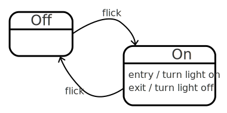

## Welcome to the (unfinished) world of Statecharts

What is a statechart?

A statechart can be explained in many ways, and we'll get to those explanations, but essentially, a statechart is a drawing.  Here's a simple statechart:

However, this drawing might not be so useful for software engineers who want to reap the benefits outlined elsewhere on this site, so let's dive into some other ways of describing what a statechart is.  The original paper that defines statecharts bills them as "A visual formalism for complex systems" (Harel, 1987).  With that out of the way, let's try to explain statecharts.

### Introduction to statecharts

A statechart is simply a beefed up [state machine](what-is-a-state-machine.html).  The beefing up solves a lot of the problems that state machines have, especially [state explosion](state-machine-state-explosion.html).  One of the goals of this site is to help explain what statecharts are and how they are useful.

* [What is a statechart?](what-is-a-statechart.html)

### How to use statecharts

The concepts of statecharts and how they function can be applied to many programming disciplines.  They don't fit all problem spaces, but when the system in question reacts to events, and has a different _behaviour_ depending on previous events, then a statechart might be a good fit.

* how to implement in plain JS page
* how to implemnet in a react page

### Benefits of statecharts

* [Behaviour decoupled from component](benefit-decoupled-behaviour-component.html)
  * [Easy to make changes to the behaviour](benefit-make-changes-to-the-behaviour.html)
  * [Easier to reason about the code](benefit-reason-about-code.html)
  * [Behaviour can be tested independently of component](benefit-testable-behaviour.html)
* [All the states are explored](benefit-all-states-explored.html)
* [Low bug counts](benefit-low-bug-count.html)
* [Makes it easier to handle exceptional situations](benefit-handle-anomalies.html)
* [Quality Assurance can use a statechart as an exploratory tool](benefit-qa-exploration-tool.html)

### Drawbacks of statecharts

* [Need to learn something new](drawback-learn-new-technique.html)
* [It's usually a very foreign way of coding](drawback-foreign-paradigm.html)

## Executable statecharts

In addition to just using statecharts to model the behaviour in documents separte from the actual running code, it's possible to use one of various machine formats, both to design the behaviour, and at run-time to actually _be_ the behaviour.

This carries along some different benefits and drawbacks:

### Benefits of executable statecharts

* No need to translate diagrams into code
* No bugs introduced by hand translation of diagrams
* The diagrams are always in sync

### Drawbacks of executable statecharts

* The format and tools for executable statecharts is limited
* Type safety between statechart and the component is hard to enforce
