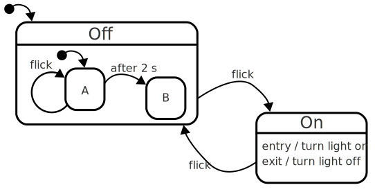

## A simple on-off statechart

Here's the simple on-off switch, the "simple state machine" that we'll extend in various ways.  In a way it will function as the "zoomed out" view of our statechart too:

We're going to specialize these two states by adding "substates" to alter the behaviour of the system, but before we continue, let's recap the behaviour of the state machine above:

- Whenever the "flick" event happens, the machine will alternate between the _on_ and _off_ states.
- Whenever it enters/leaves the on state, it invokes an _action_ to turn on or off a light accordingly.

In our refinmenent, this will _generally_ hold true, but with a few exceptions.  We'll start off by introducing a couple of new states _within_ the off state.  These _substates_ specialize the behaviour of the off state: It causes it to change behaviour.

Here's the statechart:

The off state now has it's own little state machine diagram, complete with

- Initial state (A)
- Some states handle the 'flick' event, (A)
- Some states don't handle the flick event (B)
- A new event _after 2 s_ indicates a _delayed_ transition.

If the whole statechart is a bit overwhelming, you can try to block out the rest of the statechart, leaving only the OFF state:

Since _A_ is the initial state, then whenever the _off_ state is entered, it also automatically enters the _A_ state.  When a state machine is in two states like this at the same time, it is the "deepest" one that gets to handle an event first.  So when the machine is in the _A_ state, the "flick" event will be handled by _A_ by transitioning to itself: The _A_ state points back to _A_.  Such an event is _consumed_ by the deepest state.

The _delayed_ transition going from _A_ to _B_ (after 2 seconds) causes the machine enter _B_ if and only if it has been in _A_, uninterrupted, for 2 seconds.

When the machine is in the _B_ state, and the _flick_ event happens, the _B_ state doesn't care, and so the parent _Off_ state handles it, by transitioning to the _On_ state.

This is a simple way of defining precise debouncing behaviour.  Note how in this state machine, the debouncing only happens for the Off state, and that should the flick event happen in rapid succession, the On state would be exited on the first instance of the event.

### Refining the _On_ state

For the _On_ state, we want to do something a bit more special: We want to delay the _on_ action a bit, but allow the _flick_ event to transition us to the _Off_ state at any time.  To do this we specialize the _on_ state and move the actions to another substate, so that the entry/exit actions only happen a short time after it's been in the _On_ state.
