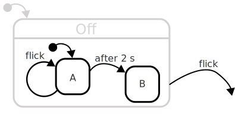
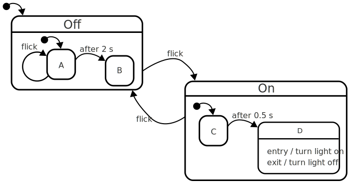
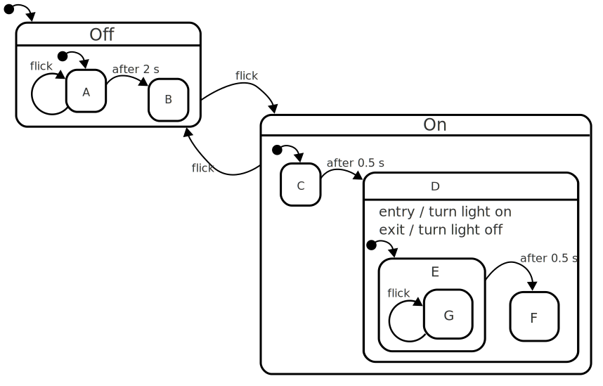

## A simple on-off statechart

Here's the simple on-off switch, the "simple state machine" that we'll extend in various ways.  In a way it will function as the "zoomed out" view of our statechart too:

We're going to specialize these two states by adding "substates" to alter the behaviour of the system, but before we continue, let's recap the behaviour of the state machine above:

- Whenever the "flick" event happens, the machine will alternate between the _on_ and _off_ states.
- Whenever it enters/leaves the on state, it invokes an _action_ to turn on or off a light accordingly.

In our refinmenent, this will _generally_ hold true, but with a few exceptions.  We'll start off by introducing a couple of new states _within_ the off state.  These _substates_ specialize the behaviour of the off state: It causes it to change behaviour.

Here's the statechart:

The off state now has it's own little state machine diagram, complete with

- Initial state (A)
- Some states handle the 'flick' event, (A)
- Some states don't handle the flick event (B)
- A new event _after 2 s_ indicates a _delayed_ transition.

If the whole statechart is a bit overwhelming, you can try to block out the rest of the statechart, leaving only the OFF state:

Since _A_ is the initial state, then whenever the _off_ state is entered, it also automatically enters the _A_ state.  When a state machine is in two states like this at the same time, it is the "deepest" one that gets to handle an event first.  So when the machine is in the _A_ state, the "flick" event will be handled by _A_ by transitioning to itself: The _A_ state points back to _A_.  Such an event is _consumed_ by the deepest state.

The _delayed_ transition going from _A_ to _B_ (after 2 seconds) causes the machine enter _B_ if and only if it has been in _A_, uninterrupted, for 2 seconds.

When the machine is in the _B_ state, and the _flick_ event happens, the _B_ state doesn't care, and so the parent _Off_ state handles it, by transitioning to the _On_ state.

This is a simple way of defining precise debouncing behaviour.  Note how in this state machine, the debouncing only happens for the Off state, and that should the flick event happen in rapid succession, the On state would be exited on the first instance of the event.

### Refining the _On_ state

For the _On_ state, we want to do something a bit more special: We want to delay the _on_ action a bit, but allow the _flick_ event to transition us to the _Off_ state at any time.  To do this we specialize the _on_ state and move the actions to another substate, so that the entry/exit actions only happen a short time after it's been in the _On_ state.

Here's the statechart:

The new states (named _C_ and _D_ here to keep things simple) cause the side effects of entering the _On_ state to be delayed by half a second.  However, since none of these substates handle the _flick_ event, then if that event happens at any time in the _On_ state, the state machine immediately goes back to the _Off_ state.

It's interesting to note that the "turn off" action will only be called if the _turn on_ action was ever called, since it's only possible to exit _D_ if it ever entered _D_ in the first place.

### Refining the _On_ state even further

Let's say the business side says that they don't like the behaviour in that if you happened to turn the light on and then off again at just the right moment (0.6 seconds), the light might be on for a tiny fraction of a second (0.1 seconds), and for whatever reason they want the light to never be turned on for less than 0.5 seconds, i.e. that the "turn lights off action should never be called immediately after a turn lights on action, but be powered on for at least 0.5 seconds"

Well that's simple to accommodate in a Statechart; just specialize the _D_ state by adding a few new substates.  These new states would be tasked to handle the _flick_ event for the first 0.5 seconds and essentially "do nothing" if it happens.

### On state for 1/2 second

When in the D state, the _flick_ event should be ignored for 0.5 seconds.  This requires a few new state:

- One for when the Off state should be *ignoring* the event (let's call this E)
- One for when the Off state should be *handling* the event (let's call this F)

It should stay in E for 0.5 seconds and then transition to F

In order to ignore the event, we introduce a substate of E, called _G_ which simply is there to ignore the event.

Here's the new _D_ state, with substates:

Here's the full statechart:

\[[SCXML version](on-off-delayed-exit-1.scxml.xml)]
\[[xstate version](on-off-delayed-exit-1.xstate.json)]

### Conclusion

In all of these examples above, the business logic (the _turn light on_ and _turn light off_) has been left untouched. All of this new behaviour has been designed in a Statechart.  This page has shown a few of the techniques that can be used to solve various problems.

The problem being solved is a bit contrived, and albeit the problem domain is relatively simple (turn a light on or off at the flick of a switch) it does a lot more than a simple boolean:

- When the light is off, any attempts to turn it on again less than 2 seconds after it was turned off will fail. Only when the switch hasn't been flicked for 2 seconds does the switch start "working" again
- When a flick of the switch would cause the light to turn on, it doesn't actually cause the light to turn on until after 0.5 seconds.  If the switch is flicked again, the light won't actually be turned on.
- When a flick of the swith turns the light on after 0.5 seconds, any additional flicks of the switch are simply ignored for a further 0.5 seconds

Additionally no weird bugs such as rogue timers cause events to fire out-of-order.  In a normal, imperative implementation of this, it is common to forget to cancel any timers that have been started, causing the effects of the timer to be executed even though they were not supposed to.  This whole class of bugs no longer exist.

Finally, the diagram itself is pretty explanatory.  One can focus on the top level _On_ and _Off_ states to get a general understanding of what the machine does, and then look into each state in isolation to understand how each one functions.
