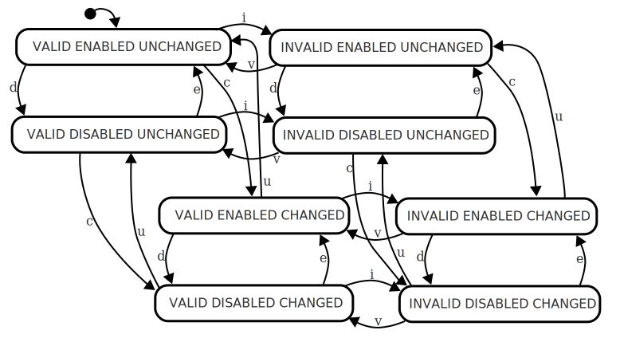

## State Machine: State Explosion

The main problem hampering wide usage of state machines is the fact that beyond very simple examples, state machines often end up with a large number of states, a lot of them with identical transitions.

A classic example is that of a user interface element that might be modeled as being _valid_ or _invalid_ and have a state machine that describes the behaviour.  Here is an example of such a simple state machine.

The machine starts in the Valid state, and upon receiving the events _i_ or _v_, transitions to the _invalid_ or _valid_ states, respectively.

Now let's say we wanted to allow the component to be enabled; the state machine would need to know that a component is _enabled_ or _disabled_ .   With traditional state machines you end up with four states: _valid/enabled_, _invalid/enabled_, _valid/disabled_, and _invalid/disabled_.

To begin with, this doesn't look too bad, we've omitted the transitions.  First off, we need two sets of transitions for the existing _i_ and _v_ events, and we need similar transitions for the _e_ and _d_ events for _enable_ and _disable_.  In total we can see that in order to support four states, we need eight transitions:

Four states isn't such a big problem, see what happens when we add another feature that we want to model.  If we add a dirty bit to indicate that the user has made a change to the field, then we end up with state names like _valid/enabled/unchanged_ and a total of 8 states:

Some states might also not make sense to model; perhaps an unchanged field should not be considered invalid; then you have to document why the _invalid/enabled/unchanged_ state doesn't exist, and that it wasn't just "forgotten"

What we are witnessing is referred to as the "state explosion" of state machines, because adding a new aspect to the state machine can sometimes double the number of states that need to be modeled, and creates a disproportionately high number of transitions.

## Statecharts

Statecharts address this problem by way of hierarchy and parallel states.  In a statechart you can model the aspects as individual substates as it sees fit.

If we start out with the simple "valid / invalid" state machine:

In a statechart world, states are organized hierarchically, so when we want to model a new trait, we try to understand how this new trait matches the existing states.

In the first case (enabled / disabled) we could decide that the valid/invalid trait is only actually useful when we are in the _enabled_ state.

/* TK picture of valid/invalid as substate of enabled */

Likewise, when we add the trait "unchanged" we might say that changing something is only applicable when it is _enabled_ so we can introduce the state there:

/* TK enabled ( unchanged / changed ( valid / invalid) ) / disabled */

## See also

* [What is a statechart?](what-is-a-statechart.html)
* [How to use statecharts](how-to-use-statecharts.html) 
