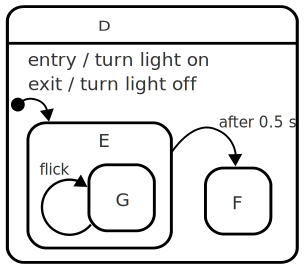

## What is a statechart?

A statechart is a [state machine](what-is-a-state-machine.html) where each state in the state machine may define its own _subordinate_ state machines, called _substates_.

Here's an example of a state in a state machine, with some extra "substates":

When the state machine enters this state _D_ it also starts the state machine within it.  The _initial state_ of this machine inside _D_ is in fact _E_ so it _enters_ _E_ too.  And since _E_ has a single substate _G_, it is also _entered_.

More generally:

- When a state is entered, its sub state machine starts and therefore, a substate is entered
- When a state is exited, its sub state machine is exited too, i.e. any substates also exit
- This happens in addition to normal state machine behavior, namely entry and exit actions.

In the example above, when the machine is told to enter _D_, it actually ends up entering _D_, _E_, and _G_.

Like state machines, statecharts also react to events; events are _dealt with_ by the states and the main side effects are specified by what happens upon entering and exiting states.

Statecharts aren't restricted to just two levels; a statechart is a hierarchical structure, much like a file system or Object Oriented inheritance or prototype hierarchies.

Note also that a state may define several independent subordinate state machines; in this scenario, when a state is entered, then _all_ of the subordinate state machines "start" and enter their initial state.  In the statechart terminology, this is called a "parallel" state

### See also

To get a full explanation of the statechart shown above, see [the description of the on-off statechart](on-off-statechart.html).
